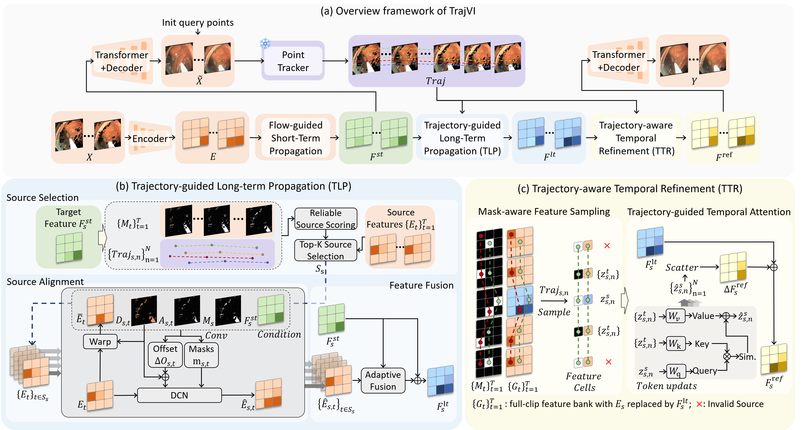
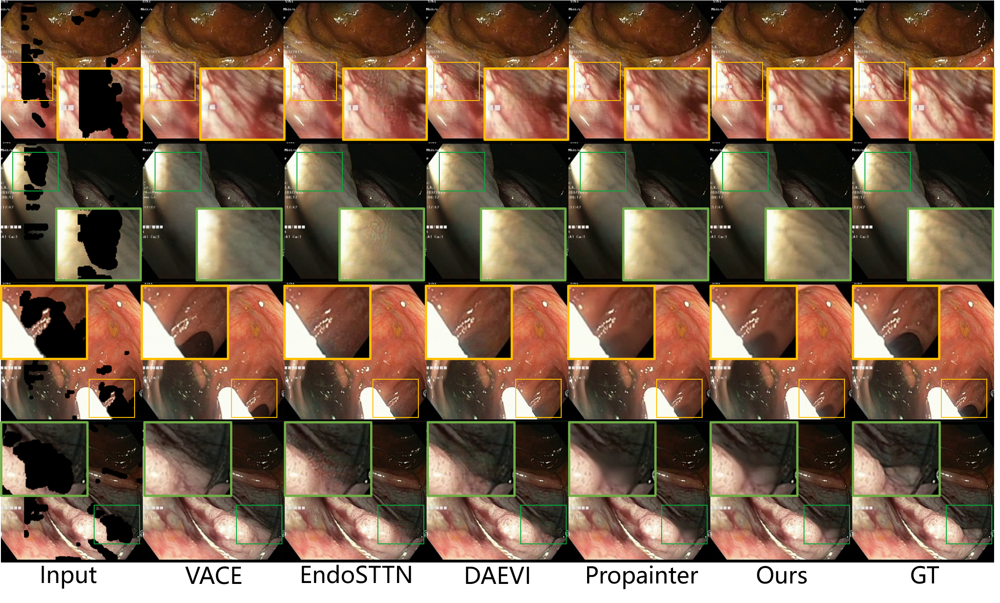

<div align="center">

# TrajVI: Trajectory-Guided Long-term Correspondence For Endoscopic Video Inpainting


<p>
  <a href="https://github.com/YingJGuo/TrajVI"></a>
  
  
  
</p>

</div>

TrajVI uses long-term point trajectories to improve video inpainting in
endoscopic scenes. A short-term flow-guided branch first produces a coarse
repair, then CoTracker3 trajectories guide long-term feature propagation (TLP)
and trajectory-aware temporal refinement (TTR).

<div align="center">
  
</div>

## Results

On the Endo-STTN benchmark, the released Full V4 model obtains **32.72 dB** PSNR-Crop and **0.8684** SSIM-Crop:


<div align="center">
  
</div>

## Installation

Python 3.10 is recommended. Install a PyTorch and torchvision build matching
your CUDA version, then install the remaining dependencies:

```bash
conda create -n trajvi python=3.10 -y
conda activate trajvi

# Install a matching PyTorch/torchvision build first.
python -m pip install -r requirements.txt
```

## Dataset

Prepare the Endo-STTN dataset with the
[official instructions](https://github.com/endomapper/Endo-STTN/tree/main/dataset_prep).
The default inference layout is:

```text
DATA_ROOT/
└── Endo_STTN/
    ├── test.json
    ├── JPEGImages/
    │   └── video_name.zip
    └── AnnotationsShifted/
        └── video_name.zip
```

Each frame archive and its matching mask archive should contain the same
number of frames. Folder-based input is also supported with
`--storage-format folder`.

## Pretrained Weights

Download the pretrained weights from
[Google Drive](https://drive.google.com/drive/folders/1KLLVyYrOpX2DYMicZEWu4UEP0yzbpuOW?usp=sharing)
and place all files in `weights/`:

```text
weights/
├── gen_best_psnr.pth
├── raft-things.pth
├── recurrent_flow_completion.pth
└── scaled_offline.pth
```

## Inference

Run the Full V4 model from the repository root:

```bash
python infer.py \
  --data-root /path/to/data \
  --dataset-name Endo_STTN \
  --split test \
  --storage-format zip \
  --frame-dir JPEGImages \
  --mask-dir AnnotationsShifted \
  --checkpoint weights/gen_best_psnr.pth \
  --raft-checkpoint weights/raft-things.pth \
  --flow-checkpoint weights/recurrent_flow_completion.pth \
  --cotracker-checkpoint weights/scaled_offline.pth \
  --output-root results/trajvi_full_v4 \
  --gpus 0
```

The generated MP4 and lossless frame results are saved under:

```text
results/trajvi_full_v4/video_name/
├── inpaint_out.mp4
└── overlaid/notshifted/frameresult/*.png
```

Useful options:

```bash
# Run selected videos.
python infer.py ... --video VIDEO_NAME

# Run a short smoke test.
python infer.py ... --video VIDEO_NAME --max-frames 60

# Use multiple GPUs.
python infer.py ... --gpus 0 1
```

## Evaluation

Evaluate the saved frame results with the CPU/skimage protocol:

```bash
python evaluate.py \
  --output-root results/trajvi_full_v4 \
  --result-root results/trajvi_full_v4_metrics \
  --method TrajVI-Full-V4 \
  --data-root /path/to/data \
  --dataset-name Endo_STTN \
  --split test \
  --storage-format zip \
  --frame-dir JPEGImages \
  --mask-dir AnnotationsShifted \
  --mask-dilation 8
```

The macro-average metrics are written to
`official_cpu_metrics_macro.csv`. The main columns are `PSNRCropavg`,
`SSIMCropFullavg`, and `MSECropavg`.

## Acknowledgements

TrajVI builds on [Endo-STTN](https://github.com/endomapper/Endo-STTN),
[DAEVI](https://github.com/FrancisXZhang/DAEVI),
[ProPainter](https://github.com/sczhou/ProPainter),
[RAFT](https://github.com/princeton-vl/RAFT), and
[CoTracker3](https://github.com/facebookresearch/co-tracker).
